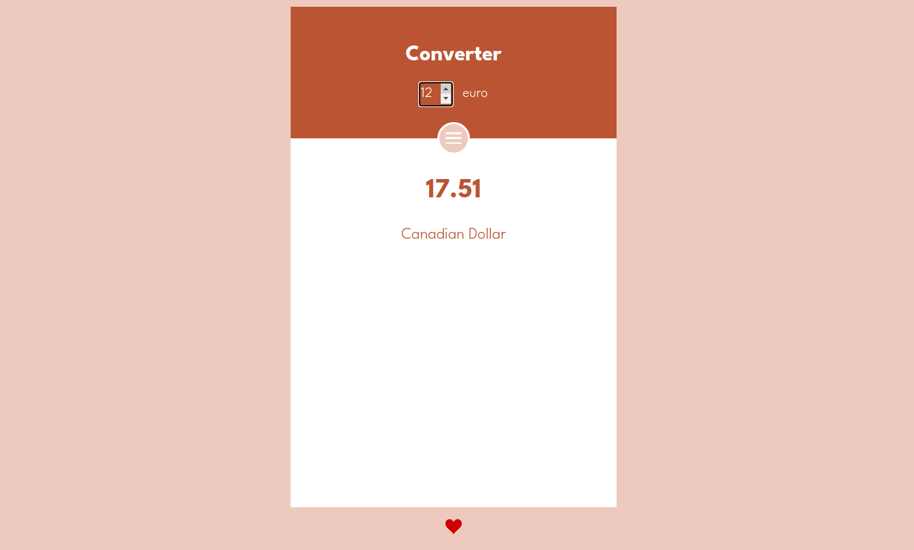

# Converter

Convertisseur de devises réalisé durant ma formation à l'école 'O'Clock' qui permet de calculer combien vous pourriez obtenir de votre monnaie en devises étrangères.

# Langages et technologies utilisés

- Javascript, Reactjs
- Data en fichier JSON
- Sass

# Screenshots

